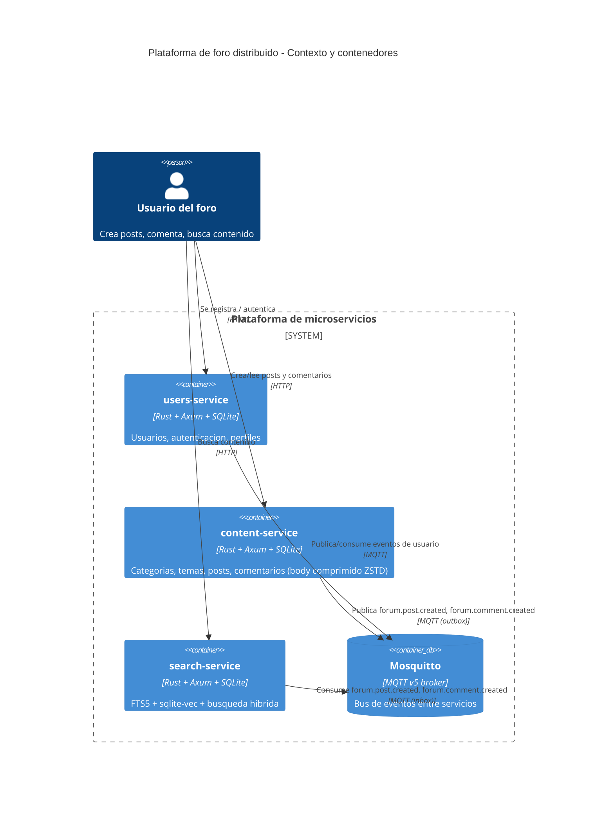
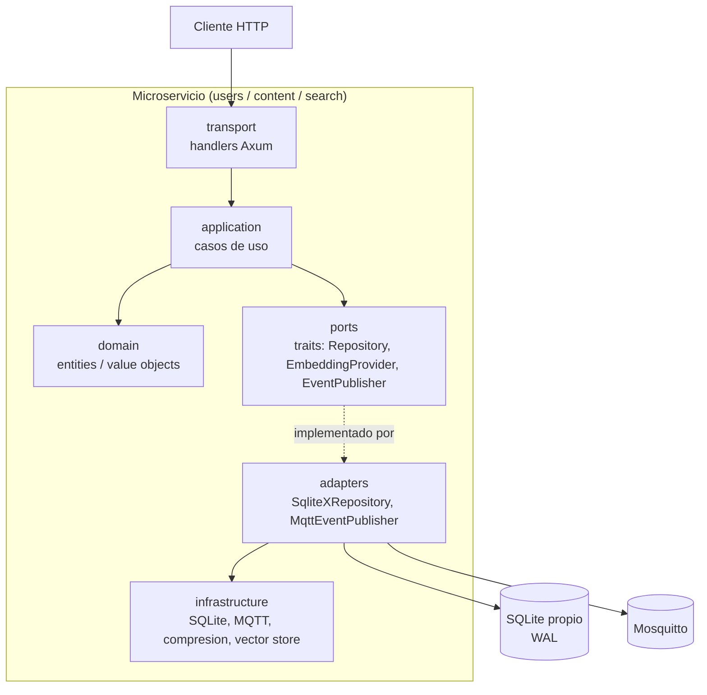
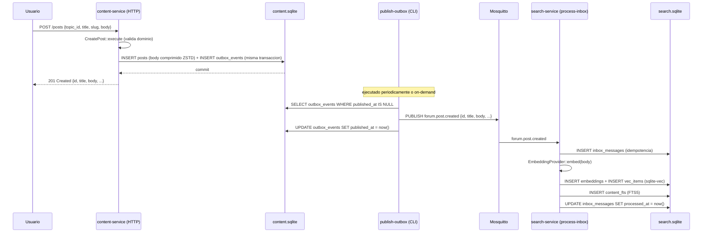
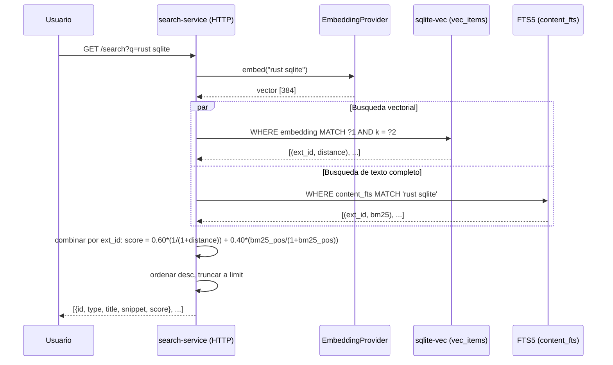

# ARCHITECTURE.md

Describe la arquitectura actual del proyecto.

### Vision general

Plataforma de microservicios ligeros orientados a eventos. Cada
microservicio sigue arquitectura hexagonal (Ports & Adapters) + DDD, es
dueño absoluto de su propia base SQLite, y se comunica con los demás
exclusivamente vía MQTT (nunca por acceso directo a bases de datos ajenas
ni llamadas síncronas entre servicios). La dependencia de código siempre
apunta hacia el dominio; nunca se permiten dependencias inversas. Cada
servicio implementa Inbox (para consumo idempotente de mensajes) y Outbox
(para publicar eventos solo después del commit local).

### Modulos principales

- `users-service` (`users.sqlite`): usuarios, autenticación, perfiles.
- `content-service` (`content.sqlite`): categorías, temas, posts,
  comentarios. Comprime `posts.body` / `comments.body` con ZSTD.
- `search-service` (`search.sqlite`): índice FTS5, embeddings (sqlite-vec),
  búsqueda híbrida.

Cada servicio se estructura internamente en capas:
```
transport      → Axum handlers, solo invocan casos de uso
application     → casos de uso / application services
domain          → entities, value objects, domain services
ports           → interfaces (repositorios, EmbeddingProvider, etc.)
adapters        → implementaciones de ports (ej. SQLiteRepository)
infrastructure  → SQLite, MQTT (rumqttc), compresion ZSTD, vector store (sqlite-vec)
```

### Flujo principal

Creación de un post:
1. `content-service` recibe `POST /posts` (HTTP). El caso de uso `CreatePost`
   valida y persiste el post (con compresión ZSTD del body) y escribe un
   evento en `outbox_events` en la misma transacción.
2. Commit. El comando CLI `publish-outbox` (publisher independiente) lee
   `outbox_events` pendientes y publica `forum.post.created` por MQTT
   solo después del commit.
3. `search-service` consume el mensaje vía `process-inbox` (con
   idempotencia por `inbox_messages`), genera el embedding con
   `EmbeddingProvider` (hoy un stub determinista; TASK-SEARCH-0006
   reemplaza esto por ONNX + MiniLM sin tocar el resto del sistema), lo
   guarda en `sqlite-vec`, e indexa el texto en FTS5.
4. Una búsqueda (`GET /search?q=...`) combina: embedding de la query →
   `sqlite-vec` (top-k por similitud) + FTS5 (`bm25`) →
   `score = 0.60*vector + 0.40*bm25` → resultados con id, tipo, title,
   snippet, score.

Ver diagramas de secuencia más abajo para el detalle paso a paso.

### Diagrama C4 (contexto + contenedores)



### Diagrama de componentes (por microservicio)

Todos los servicios siguen la misma estructura interna; este diagrama
generaliza el patrón:



La dependencia de código siempre va hacia abajo y hacia el dominio:
`transport → application → domain/ports`. `adapters`/`infrastructure`
implementan los `ports` pero el dominio nunca los conoce.

### Diagrama de secuencia: creación de un post



### Diagrama de busqueda hibrida



### Restricciones

- Dependencias prohibidas: PostgreSQL, MySQL, Redis, Elasticsearch,
  OpenSearch, Kafka, RabbitMQ, ORMs.
- Ningún microservicio accede a la SQLite de otro; solo MQTT.
- Los Use Cases nunca acceden a SQLite directamente, solo vía repositorios
  (interfaces) implementados por `SQLiteRepository`.
- Los handlers HTTP nunca acceden al repositorio directamente, solo a
  casos de uso.
- Nunca publicar un evento MQTT antes del commit local (outbox pattern).

### Riesgos

- Concurrencia de escritura en SQLite con una sola conexión por proceso:
  mitigado con WAL + `busy_timeout=5000` + diseño de acceso secuencial.
- Pérdida de eventos MQTT (broker caído): mitigado con outbox persistente
  y reintentos del publisher; mensajes fallidos van a `forum.deadletter`.
- Procesamiento duplicado de mensajes: mitigado con `inbox_messages` e
  idempotencia explícita en cada caso de uso.
- Cambio de modelo de embeddings: aislado detrás del trait
  `EmbeddingProvider` para no romper el resto del sistema. La elección
  entre el stub determinista (default, sin dependencias nativas) y el
  provider ONNX/MiniLM real es una decisión de build/runtime (Cargo
  feature `onnx-embeddings` + `SEARCH_EMBEDDING_PROVIDER`), no una
  limitante fija — ver DEC-0006. El provider ONNX real añade ~28 MB al
  binario (ONNX Runtime enlazado estáticamente) y ronda ~90 MB de RSS en
  frío (medido en macOS arm64); en Raspberry Pi real esto debe
  remedirse antes de adoptarlo como default.
